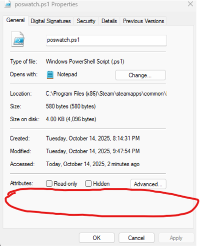

# Deadlock Movement Config

Cfgs and scripts to help learn Deadlock movement with features like hotkey position save/restore and collections of spots with hints.

## Instructions

Place the cfg files from the Deadlock/game/citadel/cfg folder into your Deadlock cfg folder.

Open leiftoolspwsh.cfg to change the 5 and 6 to the keys you'd like for cycling spots. 
Visit pos_tools.cfg to change other keybinds.

Default binds:
O - save position
H - load position
F8 - Start testing map
F9 - Swap teams
F10 - Setup the map (stop trooper spawns, spawn neutrals, enable sandbox overlay)
F12 - Toggle HUD on and off

Type leifhelp in the console to see my compiled lists of map positions.
Enter the names of any list to load them.

### Windows

Place poswatch.ps1 and startup.bat in your Deadlock folder.

Either add "-condebug" to your Deadlock launch options and start the powershell script manually, or replace your Deadlock launch options with:
"startup.bat" %COMMAND%
(quotes included)
You can open startup.bat and place launch options for deadlock behind deadlock.exe if needed.

If you use the .bat option, you may need to re-enable the console in your Deadlock settings.

### Linux

Place poswatch_linux.sh and startup.sh in your Deadlock folder (typically `~/.steam/steam/steamapps/common/Deadlock`).

Make the scripts executable:
```
chmod +x poswatch_linux.sh startup.sh
```

Then set your Deadlock Steam launch options to:
```
"/path/to/Deadlock/startup.sh" %command%
```
(quotes included, replace `/path/to/Deadlock` with your actual Deadlock folder path)

Alternatively, add `-condebug` to your launch options and run `./poswatch_linux.sh` manually from the Deadlock folder.

## Troubleshooting

### Windows

If the save and restore functionality does not work, but everything else does, it is likely that the powershell script isn't running. If the .bat file runs but the cmd prompt doesn't remain open, this is also a sign that the powershell script is failing.

Here are steps to try:

1. Hit "Win + R" and type "powershell.exe". When it opens, enter "Get-ExecutionPolicy -List"
2. If all the policies are Undefined, run "Set-ExecutionPolicy -Scope CurrentUser RemoteSigned"
3. Now right click the properties of the poswatch.ps1 file. There may be settings related to it being blocked, as in this images circled area:

4. If it is blocked, then unblock it here and Apply. The script should now run.

Alternatively, you can set your execution policy to "Unrestricted", which will allow scripts downloaded from the internet to run without being unblocked first, and see if it works that way. I wouldn't recommend leaving this setting this way.

### Linux

If position save/restore does not work:

1. Make sure the scripts are executable: `chmod +x poswatch_linux.sh startup.sh`
2. Verify that `console.log` is being created in `Deadlock/game/citadel/` (requires `-condebug` launch option)
3. Try running `./poswatch.sh` manually from the Deadlock folder and saving a position in-game to see if `lastpos.cfg` gets updated
